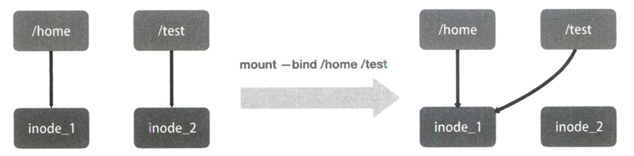

# 重新认识 Linux 容器

编写一个 app.py，用 Flask 框架启动一个 web 服务器，打印一些相关信息。尝试用 docker 容器化这个应用。

```PYTHON
from flask import Flask
import socket
import os

app = Flask(__name__)

@app.route('/')
def hello():
    html = "<h3>Hello!</h3><b>Hostname:</b> {hostname}<br/>"
    return html.format(name=os.getenv("NAME", "world"),hostname=socket.gethostname())

if __name__ == "__main__":
    app.run(host='0.0.0.0', port=80)
```

Docker 提供了一种便捷的制作 rootfs 的方式：Dockerfile。

```Dockerfile
# 使用官方提供的Python开发镜像作为基础镜像
FROM python:2.7-slim

# 将工作目录切换为/app
WORKDIR /app

# 将当前目录下的所有内容复制到/app下
ADD . /app

# 使用pip命令安装这个应用所需要的依赖
RUN pip install --trusted-host pypi.python.org -r requirements.txt

# 允许外界访问容器的80端口
EXPOSE 80

# 设置环境变量
ENV NAME World

# 设置容器进程为：python app.py
CMD ["python", "app.py"]
```

其中大写高亮的部分是 Dockerfile 的原语，按顺序处理。更多详情参考[Dockerfile](https://docs.docker.com/build/building/best-practices/#:~:text=What%20is%20a%20Dockerfile%3F,can%20find%20at%20Dockerfile%20reference.)。

完成后当前的目录结构为

```SHELL
$ ls
app.py  dockerfile  requirements.txt
$ cat requirements.txt
Flask
```

使用`docker build -t helloworld .`制作镜像，`-t`表示给镜像加一个 tag。之后 docker 会一次执行文件中的原语，每次执行后都会生成一个对应的镜像层，即使像 ENV 那样没有修改文件的操作。

接下来运行容器

```shell
$ docker images
REPOSITORY                   TAG                                              IMAGE ID       CREATED          SIZE
helloworld                   latest                                           2bac326319e7   11 minutes ago   158MB

# -p 4000:80 将容器内的80端口映射在宿主机的4000端口上
$ docker run -p 4000:80 helloworld
 * Serving Flask app "app" (lazy loading)
 * Environment: production
   WARNING: This is a development server. Do not use it in a production deployment.
   Use a production WSGI server instead.
 * Debug mode: off
 * Running on http://0.0.0.0:80/ (Press CTRL+C to quit)
```

通过另外一个终端发送请求可以看到

```SHELL
$ curl http://localhost:4000
<h3>Hello!</h3><b>Hostname:</b> c5356dedd018<br/>
```

可以通过 exec 子命令进入容器，commit 子命令可以将修改提交到镜像中保存

```SHELL
$ docker ps
CONTAINER ID   IMAGE        COMMAND           CREATED          STATUS          PORTS                                   NAMES
751738a54ef1   helloworld   "python app.py"   12 seconds ago   Up 11 seconds   0.0.0.0:4000->80/tcp, :::4000->80/tcp   recursing_wright
$ docker exec -it 751738a54ef1 /bin/bash
root@751738a54ef1:/app# touch test.txt
root@751738a54ef1:/app# exit
exit
$ docker commit -it 751738a54ef1 imagename:tag
```

Namesapce 之间虽然是隔离的，但是他们的信息在宿主机上都是实际存在的。

```SHELL
$ docker ps
CONTAINER ID   IMAGE        COMMAND           CREATED         STATUS         PORTS                                   NAMES
1a7077cf6e7c   helloworld   "python app.py"   6 seconds ago   Up 6 seconds   0.0.0.0:4000->80/tcp, :::4000->80/tcp   heuristic_keller
$ docker inspect --format '{{.State.Pid}}' 1a7077cf6e7c
92555
$ ls -l /proc/92555/ns
total 0
lrwxrwxrwx 1 root root 0 7月  20 11:18 cgroup -> 'cgroup:[4026531835]'
lrwxrwxrwx 1 root root 0 7月  20 11:18 ipc -> 'ipc:[4026532149]'
lrwxrwxrwx 1 root root 0 7月  20 11:18 mnt -> 'mnt:[4026532147]'
lrwxrwxrwx 1 root root 0 7月  20 11:17 net -> 'net:[4026532151]'
lrwxrwxrwx 1 root root 0 7月  20 11:18 pid -> 'pid:[4026532150]'
lrwxrwxrwx 1 root root 0 7月  20 11:18 pid_for_children -> 'pid:[4026532150]'
lrwxrwxrwx 1 root root 0 7月  20 11:18 time -> 'time:[4026531834]'
lrwxrwxrwx 1 root root 0 7月  20 11:18 time_for_children -> 'time:[4026531834]'
lrwxrwxrwx 1 root root 0 7月  20 11:18 user -> 'user:[4026531837]'
lrwxrwxrwx 1 root root 0 7月  20 11:18 uts -> 'uts:[4026532148]'
```

可以看到容器的 PID 是 92555，容器的所有文件都能在宿主机上找到。docker exec 进程通过加入一个已有的 namespace 从而达到进入容器的目的。

## setns

docker exec依赖一个名为setns的Linux系统调用，原文中的示例代码又不管用了。总之，我们打开一个namespace下的资源后，将文件描述符（fd）交给setns后，当前的进程就能加入到这个文件对应的namespace当中了。

## docker commit

因为UnionFS的使用，容器内对镜像rootfs的任何修改都会被操作系统先复制到可读可写层，然后再修改。docker commit把最上层的可读写层加上原先容器镜像的只读层打包成一个新镜像。而init层就是为了避免执行docker commit时把docker自己对/etc/hosts等文件做的修改一并提交。

## docker volume

volume机制允许将宿主机上指定的目录或文件挂载到容器中进行读取和修改。

```SEHLL
$ docker run -v /test ...
$ docker run -v /home:/test ...
```

第一种情况下， 由于没有显示声明，dockers会创建一个临时目录挂载（/var/lib/docker/volumes/[VOLUME_ID]/_data）到容器内的/test目录。

这并不需要借助namespace，只需要在rootfs准备好之后，在执行chroot之前把Volume指定的宿主机目录（比如/home目录）挂载到指定的容器目录（比如/test目录）在宿主机上对应的目录上就完成了。

由于执行这个操作的时候容器初始化进程已经启动，mount namespace已开启，这个挂载只对该容器可见。容器初始化进程会负责完成根目录的准备、挂载设备和目录、配置hostname等一系列需要在容器内进行的初始化操作。最后通过execv系统调用让应用进程取代自己成为容器里PID=1的进程。

## bind mount

docker volume中用到的挂载技术就是绑定挂载（bind mount）机制。其主要作用就是允许将一个目录或者文件而不是整个设备挂载到指定目录上。在linux内核中，绑定挂载实际上是一个inode替换的过程，inode可以理解为存放文件内容的“对象”。



这样，修改了/test之后如果执行umount，/test下的内容就会恢复，因为修改实际发生在/home目录里。docker volume就是通过这样的挂载避免了容器运行时影响到镜像。


