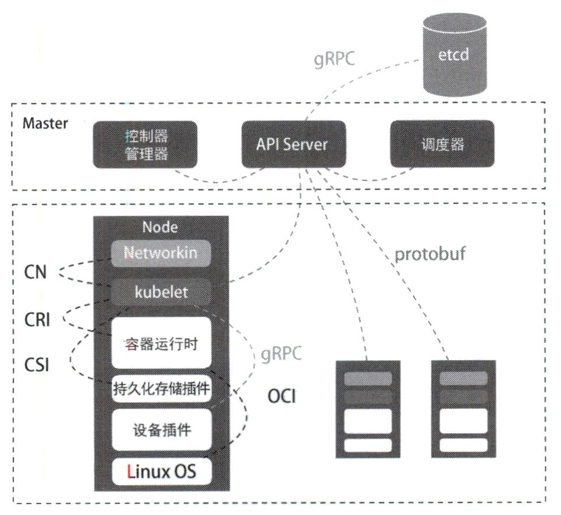
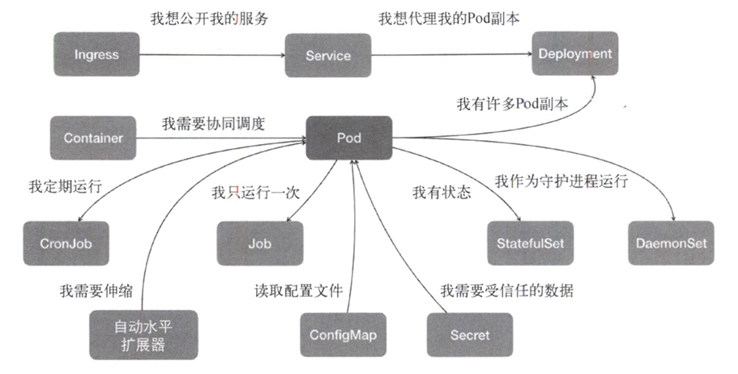

# kubernetes设计与架构

容器镜像：一组联合挂载的rootfs，是容器的静态视图；

容器运行时：Namespace+Cgroups构成的隔离环境，是容器的动态视图。

kubernetes是一个容器编排项目。

## kubernetes核心设计与架构

用户希望kubernetes带来的体验是确定的：用户提供容器镜像，由kubernetes运行在指定的集群上，此外还需要kubernetes提供路由网关、水平扩展、监控、备份、灾难恢复等一系列运维能力。

从kubertes的架构可以看到，kubernetes由Master和Node两种节点组成，分别对应控制节点和计算节点。Master节点由3个紧密协作的独立组件组合而成，分别是`负责API服务的kube-apiserver`、`负责调度的kube-scheduler`，以及`负责容器编排的kube-controller-manager`。整个集群的持久化数据，则由kube-apiserver处理后保存在etcd中。

计算节点上最核心的部分是一个名为kubelet的组件。在kubernetes项目中，kubelet主要负责同容器运行时（比如Docker项目）交互。而这种交互所依赖的是一个称作CRI（container runtime interface）的远程调用接口，该接口定义了容器运行时的各项核心操作，比如启动一个容器需要的所有参数。

此外kubelet还通过gRPC协同一个叫做Device Plugin的插件进行交互。这是kubernetes用来管理GPU等宿主机物理设备的主要组件，也是基于kubernetes项目进行机器学习训练、高性能作业支持等工作必须关注的功能。

kubelet的另一个重要功能则是调用网络插件和存储插件为容器配置网络和持久化存储。这两个插件与kubelet进行交互的接口分别是CNI（container networking interface）和CSI（container storage interface）。

## kubernetes核心能力与项目定位

kubernetes项目着重要解决的问题：在大规模集群中的各种任务之间，实际上存在各种各样的关系。这些关系的处理才是作业编排和管理系统最困难的地方。

kubernetes项目最主要的设计思想：以统一的方式抽象底层基础设施能力（比如计算、存储、网络），定义任务编排的各种关系，将这些抽象以声明式API的方式对外暴露，从而允许平台构建者基于这些抽象进一步构建自己的paas乃至任何上层平台。

在常规环境中，应用通常会被直接部署在同一台机器中，通过localhost进行通信，通过本地磁盘目录交换文件。而在kubernetes中，这些应用会被划分为一个Pod，Pod里的容器共享同一个Network Namespace、同一组Volume从而实现高效的交互。Pod是kubernetes中最基础的一个对象。

以此为基础延展出kubernetes的核心功能如下图。

kubernetes没有为每一个管理功能创建一条指令，然后实现其中的逻辑。其推崇的方法是：

* 定义任务编排对象描述试图管理的应用
* 为上面定义的对象定义运维能力对象

这种使用方法就是所谓的“声明式API‘。这种API对应的编排对象和服务对象都是kubernetes中的API对象。这是kubernetes最核心的设计理念。

